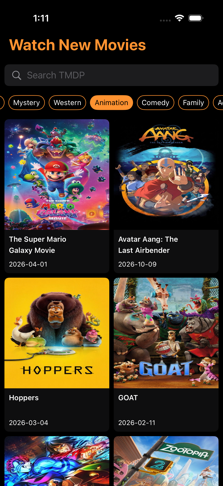
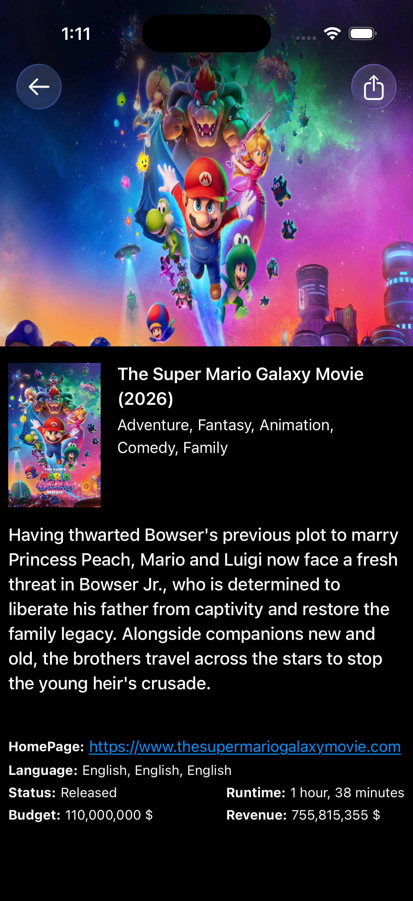

# MoviesApp

A SwiftUI movie browsing app built with a clean layered architecture. The app lets users explore trending movies, filter by genre, search locally across fetched results, and open a detailed movie screen with rich metadata.

## Preview

<p align="center">
  
  
</p>

## Features

- Browse trending movies
- Filter by genre
- Search movies
- View movie details
- Image caching
- Unit tests included

## Tech Stack

- `SwiftUI`
- `Combine`
- `MVVM`
- Clean Architecture (`Presentation`, `Domain`, `Data`, `Persistence`, `Networking`)
- `Kingfisher` for remote image loading and caching
- `XCTest` for unit testing

## Project Structure

```text
MoviesAppTask
├── App
├── Core
├── Data
├── Domain
├── Networking
├── Persistence
├── Presentation
└── Resources
```

## Requirements

- Xcode 16 or newer
- iOS 17.6+
- A valid TMDB API bearer token

## Configuration

Add your TMDB values in [Info.plist](/Users/fares/Desktop/IOS%20Projects/Tasks/MoviesAppTask/MoviesAppTask/Resources/Info.plist):

```text
BASE_URL = https://api.themoviedb.org/3
IMAGE_BASE_URL = https://image.tmdb.org/t/p/
API_KEY = <your_tmdb_bearer_token>
```

## Getting Started

1. Open [MoviesAppTask.xcodeproj](/Users/fares/Desktop/IOS%20Projects/Tasks/MoviesAppTask/MoviesAppTask.xcodeproj).
2. Add your TMDB configuration values.
3. Select an iPhone simulator running iOS 17.6 or later.
4. Build and run the `MoviesAppTask` scheme.

## Dependencies

- [Kingfisher 8.8.1](https://github.com/onevcat/Kingfisher)
